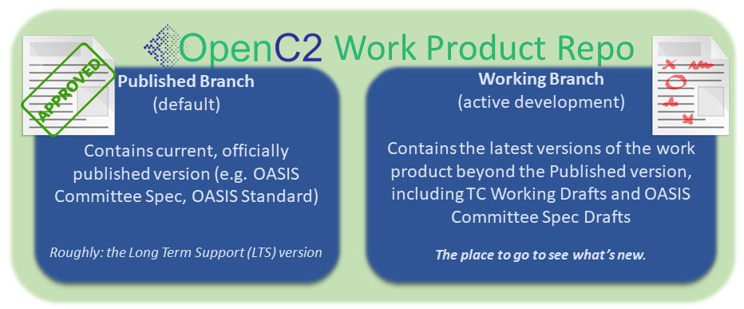

##  An OASIS [Work Product](https://www.oasis-open.org/policies-guidelines/oasis-defined-terms-2018-05-22/#dWorkProduct) Repository  

Members of the OASIS [Open Command and Control (OpenC2) Technical
Committee](https://www.oasis-open.org/committees/tc_home.php?wg_abbrev=openc2)
use this GitHub repository as part of the [TC's chartered
work](https://www.oasis-open.org/committees/openc2/charter.php).
Contributors must be Members of the TC. Work is governed by the
OASIS policies and is not done under typical open source
licensing. For more details, see the
[Contributions](#contributions) and [Licensing](#licensing)
sections below. 

## :blue_book: _Specification for Transfer of OpenC2 Messages Via MQTT_ :blue_book:

This specification provides guidance to the OpenC2 implementation
community for issuing commands and parsing responses to hardware
or software that can control administrative policies regarding
network packets.

### :twisted_rightwards_arrows: Repository Organization :twisted_rightwards_arrows:

OpenC2 work product repositories are organized a bit differently
than typical open source software project repositories:

* The **Published** (default) branch represents the current,
  stable, approved version of the work product. If the product
  hasn't progressed past an [OASIS Committee Specification Draft
  (CSD)](https://www.oasis-open.org/policies-guidelines/tc-process-2017-05-26/#committeeDraft),
  this branch is essentially empty
* The **Working** branch is where all work-in-progress content is
  captured, and is the place to go for the [current working
  version](https://github.com/oasis-tcs/openc2-ap-pf/blob/working/oc2pf.md)
  of this work product

More information about the TC's repository organizing conventions
and branching strategy can be found in our [Documentation
Norms](https://github.com/oasis-tcs/openc2-tc-ops/blob/main/Documentation-Norms.md#433-configure-repository).

###  :left_speech_bubble: Description  :left_speech_bubble:

This repository is for a packet filtering actuator profile. Actuator profiles identify the aspects of the OpenC2 language specification that are mandatory and/or meaningful in the context of a given actuator. Actuator Profiles also identify specifiers and options that are unique to the actuator. This repository will focus on the use of OpenC2 to issue commands and parse responses to hardware or software that can control administrative policies regarding network packets.

Open Command and Control (OpenC2) is a concise and extensible language to enable the command and control of cyber defense components, subsystems and/or systems in a manner that is agnostic of the underlying products, technologies, transport mechanisms or other aspects of the implementation. 

###  :writing_hand: Contributions  :writing_hand:

As stated in this repository's <a href="https://github.com/oasis-tcs/openc2-ap-pf/blob/master/CONTRIBUTING.md">CONTRIBUTING file</a>, contributors to this repository are expected to be Members of the OASIS OpenC2 TC, for any substantive change requests.  Anyone wishing to contribute to this GitHub project and <a href="https://www.oasis-open.org/join/participation-instructions">participate</a> in the TC's technical activity is invited to join as an OASIS TC Member.  Public feedback is also accepted, subject to the terms of the <a href="https://www.oasis-open.org/policies-guidelines/ipr#appendixa">OASIS Feedback License</a>.

###  :scroll: Licensing  :scroll:

Please see the <a href="https://github.com/oasis-tcs/openc2-ap-pf/blob/master/LICENSE.md">LICENSE</a> file for description of the license terms and OASIS policies applicable to the TC's work in this GitHub project. Content in this repository is intended to be part of the OpenC2 TC's permanent record of activity, visible and freely available for all to use, subject to applicable OASIS policies, as presented in the repository <a href="https://github.com/oasis-tcs/openc2-ap-pf/blob/master/LICENSE.md">LICENSE</a> file.

###  :left_speech_bubble: Further Description of this Repository  :left_speech_bubble:

Members of the <a href="https://www.oasis-open.org/committees/openc2/">OASIS Open Command and Control (OpenC2) TC</a> create and manage technical content in this TC GitHub repository ( <a href="https://github.com/oasis-tcs/openc2-ap-pf">https://github.com/oasis-tcs/openc2-ap-pf</a> ) as part of the TC's chartered work (<i>i.e.</i>, the program of work and deliverables described in its <a href="https://www.oasis-open.org/committees/openc2/charter.php">charter</a>).

OASIS TC GitHub repositories, as described in <a href="https://www.oasis-open.org/resources/tcadmin/github-repositories-for-oasis-tc-members-chartered-work">GitHub Repositories for OASIS TC Members' Chartered Work</a>, are governed by the OASIS <a href="https://www.oasis-open.org/policies-guidelines/tc-process">TC Process</a>, <a href="https://www.oasis-open.org/policies-guidelines/ipr">IPR Policy</a>, and other policies, similar to TC Wikis, TC JIRA issues tracking instances, TC SVN/Subversion repositories, etc.  While they make use of public GitHub repositories, these TC GitHub repositories are distinct from <a href="https://www.oasis-open.org/resources/open-repositories">OASIS Open Repositories</a>, which are used for development of open source <a href="https://www.oasis-open.org/resources/open-repositories/licenses">licensed</a> content.

### :envelope_with_arrow: Contact :envelope_with_arrow:

Please send questions or comments about <a href="https://www.oasis-open.org/resources/tcadmin/github-repositories-for-oasis-tc-members-chartered-work">OASIS TC GitHub repositories</a> to the <a href="mailto:tc-admin@oasis-open.org">OASIS TC Administrator</a>.  For questions about content in this repository, please contact the TC Chair or Co-Chairs as listed on the the <tc short name> TC's <a href="https://www.oasis-open.org/committees/tc_home.php?wg_abbrev=openc2">home page</a>.

# README

Members of the [OASIS Open Command and Control (OpenC2) TC](https://www.oasis-open.org/committees/openc2/) create and manage technical content in this TC GitHub repository (https://github.com/oasis-tcs/openc2-ap-edr/) as part of the TC's chartered work (the program of work and deliverables described in its [charter](https://www.oasis-open.org/committees/openc2/charter.php).

OASIS TC GitHub repositories, as described in [GitHub Repositories for OASIS TC Members' Chartered Work](https://www.oasis-open.org/resources/tcadmin/github-repositories-for-oasis-tc-members-chartered-work), are governed by the OASIS [TC Process](https://www.oasis-open.org/policies-guidelines/tc-process), [IPR Policy](https://www.oasis-open.org/policies-guidelines/ipr), and other policies. While they make use of public GitHub repositories, these repositories are distinct from [OASIS Open Repositories](https://www.oasis-open.org/resources/open-repositories), which are used for development of open source [licensed](https://www.oasis-open.org/resources/open-repositories/licenses) content.

## Description

Open Command and Control (OpenC2) is a concise and extensible
language to enable the command and control of cyber defense components, subsystems and/or systems in a manner that is agnostic of the underlying products, technologies, transport mechanisms or other aspects of the implementation. Endpoint detection and response technologies provide a means for continuous monitoring and analysis to more readily identify, detect, and prevent advanced threats. 

This OpenC2 Actuator Profile defines the Actions, Targets, Specifiers and Options that are consistent with the version 1.0 of the OpenC2 Language Specification ([OpenC2-Lang-v1.0]) in the context of command and control of various endpoint detection and response technologies.

## Contributions

As stated in this repository's [CONTRIBUTING](https://github.com/oasis-tcs/openc2-ap-edr/blob/master/CONTRIBUTING.md) file, contributors to this repository must be Members of the OASIS OpenC2 TC for any substantive contributions or change requests.  Anyone wishing to contribute to this GitHub project and [participate](https://www.oasis-open.org/join/participation-instructions) in the TC's technical activity is invited to join as an OASIS TC Member. Public feedback is also accepted, subject to the terms of the [OASIS Feedback License](https://www.oasis-open.org/policies-guidelines/ipr#appendixa). 

## Licensing

Please see the [LICENSE](https://github.com/oasis-tcs/openc2-ap-edr/blob/master/LICENSE.md) file for description of the license terms and OASIS policies applicable to the TC's work in this GitHub project. Content in this repository is intended to be part of the OpenC2 TC's permanent record of activity, visible and freely available for all to use, subject to applicable OASIS policies, as presented in the repository [LICENSE](https://github.com/oasis-tcs/openc2-ap-edr/blob/master/LICENSE.md). 

## Further Description of this Repository

*Any narrative content may be provided here by the TC, for example, if the Members wish to provide an extended statement of purpose.*

## Contact

Please send questions or comments about [OASIS TC GitHub repositories](https://www.oasis-open.org/resources/tcadmin/github-repositories-for-oasis-tc-members-chartered-work) to the [OASIS TC Administrator](mailto:tc-admin@oasis-open.org). For questions about content in this repository, please contact the TC Chair or Co-Chairs as listed on the the OpenC2 TC's [home page](https://www.oasis-open.org/committees/openc2/).
